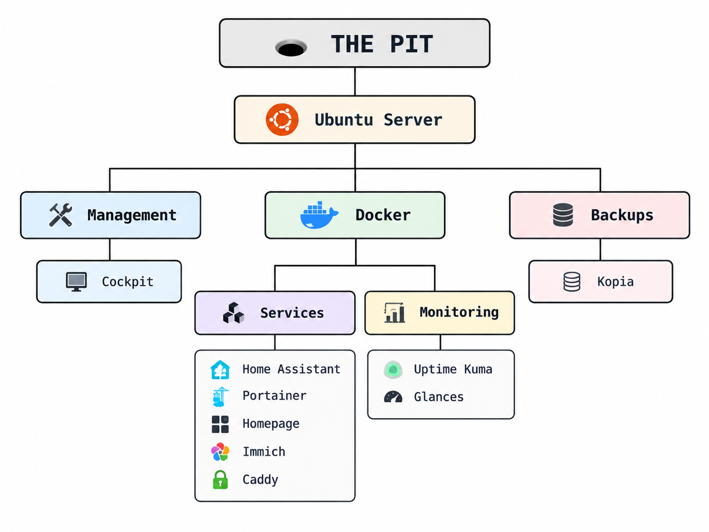

  

> 
> 
> 
> 
> It started with an Ubuntu VM.  
> There is always one more service.

My descent into the bottomless pit of homelabbing.

This is where I keep track of what I built, what I tried, what broke, what I learned, what I changed my mind about, and all the rabbit holes I fell into along the way.

This isn't meant to be a tutorial or a polished guide. It's the story of my homelab as it evolves — including the mistakes, questionable decisions, and *"while I'm here, I might as well..."* moments.

## 🕳️ Latest from the pit

<!-- LATEST:START -->

> 🤖 **Generated automatically:** The latest entries from across the pit.

| Type | # | Date | Entry |
|---|---:|---|---|
| 📖 Diary | `0010` | 2026-09-19 | [I should probably manage the host too](diary/2026/09/0010-i-should-probably-manage-the-host-too.md) |
| 📖 Diary | `0009` | 2026-09-18 | [Do I need a NAS?](diary/2026/09/0009-do-i-need-a-nas.md) |
| 📖 Diary | `0008` | 2026-09-17 | [The homelab needs a screen](diary/2026/09/0008-the-homelab-needs-a-screen.md) |

<!-- LATEST:END -->

## ⛏️ Start digging

There are a few different ways things end up documented here.

### 📖 [The diary](diary/)

The main story.

Follow the homelab from the first Ubuntu VM through everything I built, added, changed, learned, and probably didn't need.

### 🚨 [Infrastructure incidents](diary/incidents/)

Things that broke without being invited to.

Outages, failures, unexpected behaviour, and those moments when the infrastructure decides it would also like to contribute to the diary.

### 🔧 [Troubleshooting](diary/troubleshooting/)

Problems that became investigations of their own.

The rabbit holes involving cables, networking, configuration, documentation, questionable assumptions, and eventually — hopefully — an explanation.

### 🧪 [Projects](diary/projects/)

Things that refused to fit into a single diary entry.

Longer-running builds, experiments, designs and enhancements that keep evolving while the main diary moves on.

## 🏗️ What is this running on?

The pit currently looks roughly like this:

  

This is deliberately a snapshot rather than a specification.

The homelab keeps changing. That's rather the point.

## 🗂️ Repository map

<pre>
homelabbing-pit/
├── <a href="diary/">diary/</a>
│   ├── <a href="diary/README.md">README.md</a>                 # where the story starts
│   ├── <a href="diary/entries/">entries/</a>                  # the main descent
│   ├── <a href="diary/incidents/">incidents/</a>                # things broke
│   ├── <a href="diary/troubleshooting/">troubleshooting/</a>          # why did that happen?
│   └── <a href="diary/projects/">projects/</a>                 # things that kept growing
│
├── <a href="architecture/">architecture/</a>              # diagrams and architecture snapshots
├── <a href="assets/">assets/</a>                    # images and other repository assets
├── <a href="scripts/">scripts/</a>                   # keeping the pit organised
└── <a href="telemetry/">telemetry/</a>                 # the pit is talking to the world
</pre>

The indexes under `diary/` are generated automatically from the metadata in each entry.

The stories themselves are very much written by a human who probably should have stopped adding services several containers ago.

## 🧭 Is there a roadmap?

Not really.

There are ideas.

There are plans.

There are things I definitely don't need.

And there is an alarming amount of overlap between those three categories.

## 🕳️ Current status

Still digging. ⛏️
