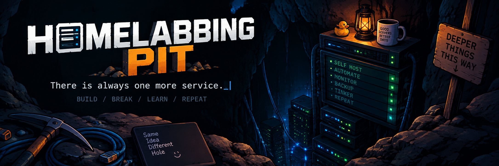

<p align="center">
  
</p>

> 
> 
> 
> 
> It started with an Ubuntu VM.  
> There is always one more service.

My descent into the bottomless pit of homelabbing.

This is where I keep track of what I built, what I tried, what broke, what I learned, what I changed my mind about, and all the rabbit holes I fell into along the way.

This isn't meant to be a tutorial or a polished guide. It's the story of my homelab as it evolves — including the mistakes, questionable decisions, and *"while I'm here, I might as well..."* moments.

## ⛏️ Start digging

There are a few different ways things end up documented here.

### 📖 [The diary](diary/)

The main story.

What I built, added, changed, learned, broke on purpose, and occasionally managed to get working again.

### 🚨 [Infrastructure incidents](diary/incidents/)

Things that broke without being invited to.

Outages, failures, unexpected behaviour, and those moments when the infrastructure decides it would also like to contribute to the diary.

### 🔧 [Troubleshooting](diary/troubleshooting/)

Problems that became investigations of their own.

The rabbit holes involving cables, networking, configuration, documentation, questionable assumptions, and eventually — hopefully — an explanation.

## 🕳️ Latest from the pit

<!-- LATEST:START -->

> 🤖 **Generated automatically:** The latest entries from across the pit.

| Type | # | Date | Entry |
|---|---:|---|---|
| 🔧 Troubleshooting | `TS01` | 2026-09-16 | [I just wanted Ethernet in the living room](diary/troubleshooting/TS01-i-just-wanted-ethernet-in-the-living-room.md) |
| 🚨 Incident | `II01` | 2026-09-13 | [Well, that didn't take long](diary/incidents/II01-freebox-step-6.md) |
| 📖 Diary | `0004` | 2026-09-13 | [Is everything still alive?](diary/2026/09/0004-is-everything-still-alive.md) |

<!-- LATEST:END -->

## 🏗️ What is this running on?

The pit currently looks roughly like this:

```text
                         🕳️ THE PIT
                              │
                       Ubuntu Server
                              │
                            Docker
                              │
                           Cockpit
                              │
              ┌───────────────┼───────────────┐
              │               │               │
          Services        Monitoring       Backups
              │               │               │
       Home Assistant    Uptime Kuma        Kopia
       Portainer         Glances
       Homepage
       Immich
       Caddy
       Immich
```

This is deliberately a snapshot rather than a specification.

The homelab keeps changing. That's rather the point.

## 🗂️ Repository map

```text
homelabbing-pit/
├── diary/
│   ├── README.md
│   ├── YYYY/
│   │   └── MM/                # the main descent
│   ├── incidents/             # things broke
│   └── troubleshooting/       # why did that happen?
│
├── architecture/              # diagrams and architecture snapshots
├── assets/                    # images and other repository assets
├── scripts/                   # repository automation
└── telemetry/                 # sanitized homelab data
```

The indexes under `diary/` are generated automatically from the metadata in each entry.

The stories themselves are very much written by a human who probably should have stopped adding services several containers ago.

## 🧭 Is there a roadmap?

Not really.

There are ideas.

There are plans.

There are things I definitely don't need.

And there is an alarming amount of overlap between those three categories.

## 🕳️ Current status

Still digging. ⛏️